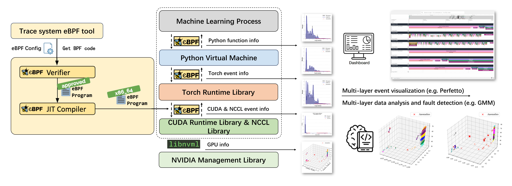

# eACGM

**eACGM:** An **e**BPF-based **A**utomated **C**omprehensive **G**overnance and **M**onitoring framework for AI/ML systems.

**English | [中文](README_zh.md)**

---

:star: **[News] Our work has been accepted by [IEEE/ACM IWQoS 2025 (CCF-B)! ](https://iwqos2025.ieee-iwqos.org/)**

**[Paper(Dropbox)](https://www.dropbox.com/scl/fi/q4vplv95usw4u5h3syx62/IWQoS_2025.pdf?rlkey=gv8h65oupkzrmv6zu1yu7s558&e=1&st=k8sttham&dl=0)**

---

eACGM provides zero-intrusive, low-overhead, full-stack observability for both hardware (GPU, NCCL) and software (CUDA, Python, PyTorch) layers in modern AI/ML workloads.



## Features

- [x] **Event tracing for CUDA Runtime** based on eBPF
- [x] **Event tracing for NCCL GPU communication library** based on eBPF
- [x] **Function call tracing for Python virtual machine** based on eBPF
- [x] **Operator tracing for PyTorch** based on eBPF
- [x] **Process-level GPU information monitoring** based on `libnvml`
- [x] **Global GPU information monitoring** based on `libnvml`
- [x] **Automatic eBPF program generation**
- [x] **Comprehensive analysis** of all traced events and operators
- [x] **Flexible integration** for multi-level tracing (CUDA, NCCL, PyTorch, Python, GPU)
- [x] **Visualization-ready data output** for monitoring platforms

## Visualization

To visualize monitoring data, deploy Grafana and MySQL using Docker. Access the Grafana dashboard at [http://127.0.0.1:3000](http://127.0.0.1:3000).

```bash
cd grafana/
sh ./launch.sh
```

Start the monitoring service with:

```bash
./service.sh
```

Stop the monitoring service with:

```bash
./stop.sh
```

## Case Demonstration

The `demo` folder provides example programs to showcase the capabilities of eACGM:

- `pytorch_example.py`: Multi-node, multi-GPU PyTorch training demo
- `sampler_cuda.py`: Trace CUDA Runtime events using eBPF
- `sampler_nccl.py`: Trace NCCL GPU communication events using eBPF
- `sampler_torch.py`: Trace PyTorch operator events using eBPF
- `sampler_python.py`: Trace Python VM function calls using eBPF
- `sampler_gpu.py`: Monitor global GPU information using `libnvml`
- `sampler_nccl.py`: Monitor process-level GPU information using `libnvml`
- `sampler_eacg.py`: Combined monitoring of all supported sources
- `webui.py`: Automatically visualize captured data in Grafana

## Citation

If you find this project helpful, please consider citing our IWQoS 2025 paper (In press, to appear).