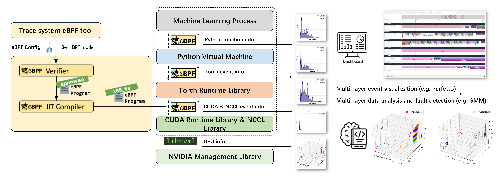

# eACGM

**eACGM:** An **e**BPF-based **A**utomated **C**omprehensive **G**overnance and **M**onitoring framework for AI/ML systems.

**[English](README.md) | 中文**

---

:star: **[News] 本项目已被 [IEEE/ACM IWQoS 2025 (CCF-B)](https://iwqos2025.org/) 正式接收！**

**[Paper(Dropbox)](https://www.dropbox.com/scl/fi/q4vplv95usw4u5h3syx62/IWQoS_2025.pdf?rlkey=gv8h65oupkzrmv6zu1yu7s558&e=1&st=k8sttham&dl=0)**

---

eACGM 实现了面向 AI/ML 工作系统的硬件（GPU, NCCL）与软件（CUDA, Python, PyTorch）的全栈观测，具有无侵入、低开销的特性。



## 主要功能

- [x] 基于 eBPF 实现对 CUDA Runtime 的事件追踪
- [x] 基于 eBPF 实现对 NCCL GPU 通信库的事件追踪
- [x] 基于 eBPF 实现对 Python 虚拟机的函数调用追踪
- [x] 基于 eBPF 实现对 PyTorch 算子的事件追踪
- [x] 基于 `libnvml` 实现进程级 GPU 信息监控
- [x] 基于 `libnvml` 实现全局 GPU 信息监控
- [x] 支持自动生成 eBPF 监控程序代码
- [x] 支持对所有捕获事件和算子的统一分析
- [x] 灵活集成 CUDA、NCCL、PyTorch、Python、GPU 等多层追踪
- [x] 可直接对接可视化平台（如 Grafana）展示监控数据

## 可视化

使用 Docker 部署 Grafana 和 MySQL 应用，通过 http://127.0.0.1:3000 访问可视化界面

```bash
cd grafana/
sh ./launch.sh
```

使用 `service.sh` 启动监听服务

```bash
sh ./service.sh
```

使用 `stop.sh` 关闭监听服务

```bash
sh ./stop.sh
```

## 案例演示

`demo` 文件夹下有演示程序：

- `pytorch_example.py`: 一个用于演示的多机多卡 Pytorch 程序
- `sampler_cuda.py`: 使用 eBPF 追踪 CUDA 事件的案例
- `sampler_nccl.py`: 使用 eBPF 追踪 NCCL 事件的案例
- `sampler_torch.py`: 使用 eBPF 追踪 Torch 算子的案例
- `sampler_python.py`: 使用 eBPF 追踪 Python 虚拟机的案例
- `sampler_gpu.py`: 使用 `libnvml` 实现对 GPU 的信息探测
- `sampler_nccl.py`: 使用 `libnvml` 实现对进程级的 GPU 信息探测
- `sampler_eacg.py`: 实现对上述所有信息探测
- `webui.py`: 自动将探测到的数据在 Grafana 上可视化

## 论文引用

如果本项目对您有帮助，欢迎引用我们即将在 IWQoS 2025 发表的论文。